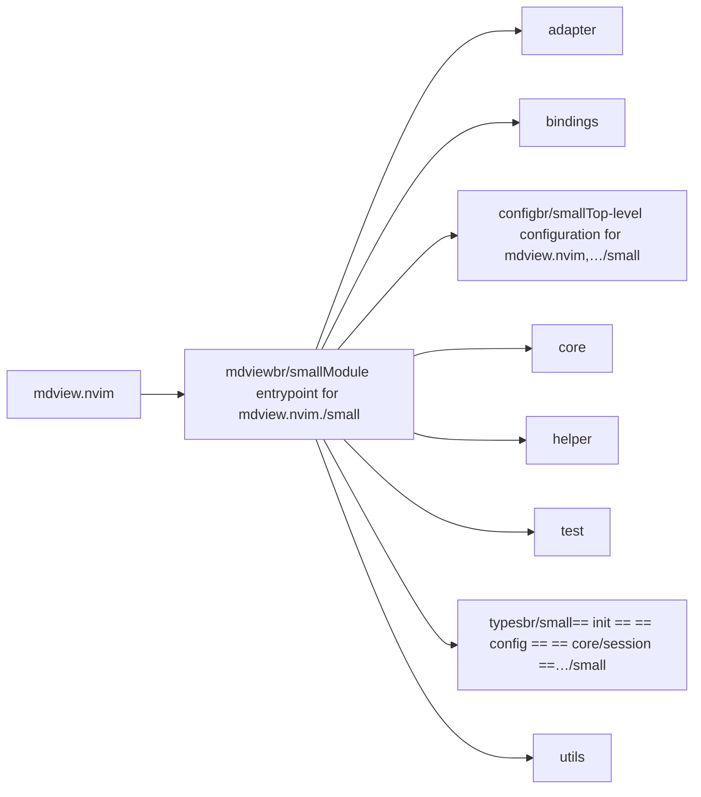
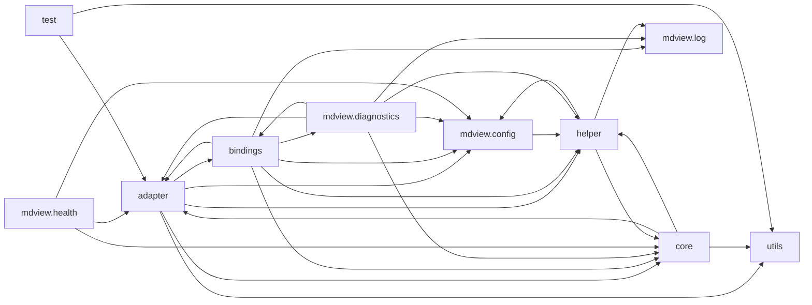

# mdview.nvim — module map

> **Generated** by `documentation`. Do not edit by hand — run `:DocMap`
> (or `nvim --headless -l scripts/gen_map.lua`) to regenerate.

**7 modules** · 8 namespaces · 69 helper files

The [interactive map](index.html) has filtering, full descriptions and
source links; this page is the version the code host renders directly.

## Namespaces

## Dependencies

Which parts of the tree require which, rolled up to the second level.
The [interactive map](index.html)'s **Deps** view has this per module,
in both directions, with load-time and lazy requires told apart.

## Modules

| Module | Description | Fns | Docs |
|---|---|---|---|
| `mdview.init` | Module entrypoint for mdview.nvim. | 2 | [src](../../lua/mdview/init.lua) |
| &nbsp;&nbsp;`adapter` |  |  |  |
| &nbsp;&nbsp;&nbsp;&nbsp;`mdview.adapter.browser` | Cross-platform helper to open the preview browser and (in isolated mode) close it later from Neovim. | 5 | [src](../../lua/mdview/adapter/browser/init.lua) |
| &nbsp;&nbsp;`bindings` |  |  |  |
| &nbsp;&nbsp;&nbsp;&nbsp;`mdview.bindings.autocmds` | Centralized autocommand setup for mdview.nvim. | 2 | [src](../../lua/mdview/bindings/autocmds/init.lua) |
| &nbsp;&nbsp;&nbsp;&nbsp;`mdview.bindings.usrcmds` | Registers the unified :MDView <subcommand> user command via lib.nvim.usercmd.composer — one route tree drives dispatch, <Tab> completion, and (via… | 2 | [src](../../lua/mdview/bindings/usrcmds/init.lua) |
| &nbsp;&nbsp;&nbsp;&nbsp;&nbsp;&nbsp;`mdview.bindings.usrcmds.start` | Action behind :MDView start. | 3 | [src](../../lua/mdview/bindings/usrcmds/start/init.lua) |
| &nbsp;&nbsp;&nbsp;&nbsp;&nbsp;&nbsp;&nbsp;&nbsp;`server` |  |  |  |
| &nbsp;&nbsp;`mdview.config` | Top-level configuration for mdview.nvim, assembled from config/DEFAULTS.lua. | 4 | [src](../../lua/mdview/config/init.lua) |
| &nbsp;&nbsp;`core` |  |  |  |
| &nbsp;&nbsp;`helper` |  |  |  |
| &nbsp;&nbsp;`test` |  |  |  |
| &nbsp;&nbsp;`mdview.types` | == init == == config == == core/session == == core/events == == adapter/runner == == adapter/ws_client == |  | [src](../../lua/mdview/types/init.lua) |
| &nbsp;&nbsp;`utils` |  |  |  |

## Drift

6 errors · 9 warnings · 43 info

| Severity | Check | Message |
|---|---|---|
| error | `missing-module-tag` | lua/mdview/bindings/autocmds/bufenter.lua has no ---@module annotation |
| error | `missing-module-tag` | lua/mdview/bindings/autocmds/bufwrite.lua has no ---@module annotation |
| error | `module-path-mismatch` | lua/mdview/init.lua declares @module 'mdview.init' but lives at 'mdview' |
| error | `module-path-mismatch` | lua/mdview/adapter/browser/probe_plattform_paths.lua declares @module 'mdview.adapter.browser.probe_platform_paths' but lives at 'mdview.adapter.browser.probe_plattform_paths' |
| error | `module-path-mismatch` | lua/mdview/bindings/autocmds/on_text_change.lua declares @module 'mdview.bindings.autocmds.on_text_changed' but lives at 'mdview.bindings.autocmds.on_text_change' |
| error | `module-path-mismatch` | lua/mdview/lps.lua declares @module 'mdview.lsp' but lives at 'mdview.lps' |
| warn | `doc-references-missing` | docs/BINDINGS.md:12 references 'mdview.config.browser.browser_autoclose', but mdview.config.browser has no 'browser_autoclose' |
| warn | `missing-summary` | lua/mdview/lps.lua has no description line |
| warn | `missing-summary` | lua/mdview/types/core.lua has no description line |
| warn | `require-not-declared` | requires "mdview.adapter.browser.probe_plattform_paths" (line 6), which no file in this tree declares |
| warn | `require-not-declared` | requires "mdview.bindings.autocmds.bufenter" (line 7), which no file in this tree declares |
| warn | `require-not-declared` | requires "mdview" (line 114), which no file in this tree declares |
| warn | `require-not-declared` | requires "mdview" (line 6), which no file in this tree declares |
| warn | `require-not-declared` | requires "mdview" (line 161), which no file in this tree declares |
| warn | `require-not-declared` | requires "mdview" (line 67), which no file in this tree declares |

43 informational findings

| Check | Message |
|---|---|
| `missing-readme` | lua/mdview has no README.md |
| `missing-readme` | lua/mdview/adapter/browser has no README.md |
| `missing-readme` | lua/mdview/bindings/autocmds has no README.md |
| `missing-readme` | lua/mdview/bindings/usrcmds has no README.md |
| `missing-readme` | lua/mdview/bindings/usrcmds/start has no README.md |
| `missing-readme` | lua/mdview/config has no README.md |
| `missing-readme` | lua/mdview/types has no README.md |
| `undocumented-param` | M.resolve has 1 parameter(s) but only 0 @param line(s) |
| `undocumented-param` | M.attach has 1 parameter(s) but only 0 @param line(s) |
| `undocumented-param` | M.attach has 1 parameter(s) but only 0 @param line(s) |
| `undocumented-param` | M.attach has 1 parameter(s) but only 0 @param line(s) |
| `undocumented-param` | M.attach has 1 parameter(s) but only 0 @param line(s) |
| `undocumented-param` | M.attach has 1 parameter(s) but only 0 @param line(s) |
| `undocumented-param` | M.start has 1 parameter(s) but only 0 @param line(s) |
| `undocumented-param` | M.try_push has 3 parameter(s) but only 0 @param line(s) |
| `undocumented-param` | M.wait has 2 parameter(s) but only 0 @param line(s) |
| `undocumented-param` | M.run has 1 parameter(s) but only 0 @param line(s) |
| `undocumented-param` | M.set_server has 1 parameter(s) but only 0 @param line(s) |
| `undocumented-param` | M.set_proc has 1 parameter(s) but only 0 @param line(s) |
| `undocumented-param` | M.set_server_job has 1 parameter(s) but only 0 @param line(s) |
| `undocumented-param` | M.update_web has 1 parameter(s) but only 0 @param line(s) |
| `undocumented-param` | M.set_browser has 1 parameter(s) but only 0 @param line(s) |
| `undocumented-param` | M.set_attached has 1 parameter(s) but only 0 @param line(s) |
| `undocumented-param` | M.set_web has 1 parameter(s) but only 0 @param line(s) |
| `undocumented-param` | M.set_web_entry has 2 parameter(s) but only 0 @param line(s) |
| `undocumented-param` | M.get_entry has 1 parameter(s) but only 0 @param line(s) |
| `undocumented-param` | M.clear_web_entry has 1 parameter(s) but only 0 @param line(s) |
| `undocumented-param` | M.register has 2 parameter(s) but only 0 @param line(s) |
| `undocumented-param` | M.detach has 1 parameter(s) but only 0 @param line(s) |
| `undocumented-param` | M.resolve has 1 parameter(s) but only 0 @param line(s) |
| `unreferenced-module` | mdview.init is required by no other file in the tree |
| `unreferenced-module` | mdview.adapter.browser.probe_platform_paths is required by no other file in the tree |
| `unreferenced-module` | mdview.bindings.autocmds.on_text_changed is required by no other file in the tree |
| `unreferenced-module` | mdview.bindings.usrcmds.start.server.try_push is required by no other file in the tree |
| `unreferenced-module` | mdview.bindings.usrcmds.start.server.waiter is required by no other file in the tree |
| `unreferenced-module` | mdview.health is required by no other file in the tree |
| `unreferenced-module` | mdview.lsp is required by no other file in the tree |
| `unreferenced-module` | mdview.test.diff_harness is required by no other file in the tree |
| `unreferenced-module` | mdview.test.runner is required by no other file in the tree |
| `unreferenced-module` | mdview.types is required by no other file in the tree |
| `unreferenced-module` | mdview.types.adapter is required by no other file in the tree |
| `unreferenced-module` | mdview.types.core is required by no other file in the tree |
| `unreferenced-module` | mdview.types.utils is required by no other file in the tree |

